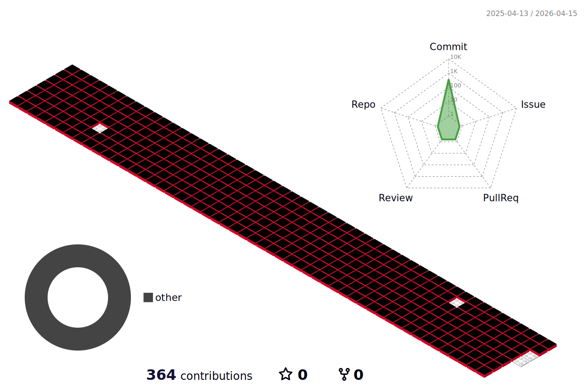

<h3 align="center">:wave: Welcome my github profile !</h3>
<h3 align="center">인공지능소프트웨어학과 20241503</h3>

📫 How to reach me = c48449299@gmail.com
  
 
 

📖Studying Programming Languages
 
 
     
 
 
 
:pencil2: Study log
 
 

