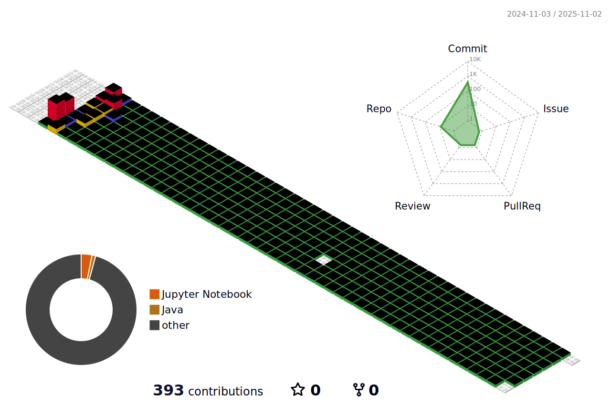

<h3 align="center">:wave: Welcome my github profile !</h3>
<h3 align="center">인공지능소프트웨어학과 20241503</h3>

📫 How to reach me = c48449299@gmail.com
 
 
📖Studying Programming Languages
 
 
    

 
 

🛠Tool🛠
 
 

 
 
:pencil2: Study Log
 
 

 

